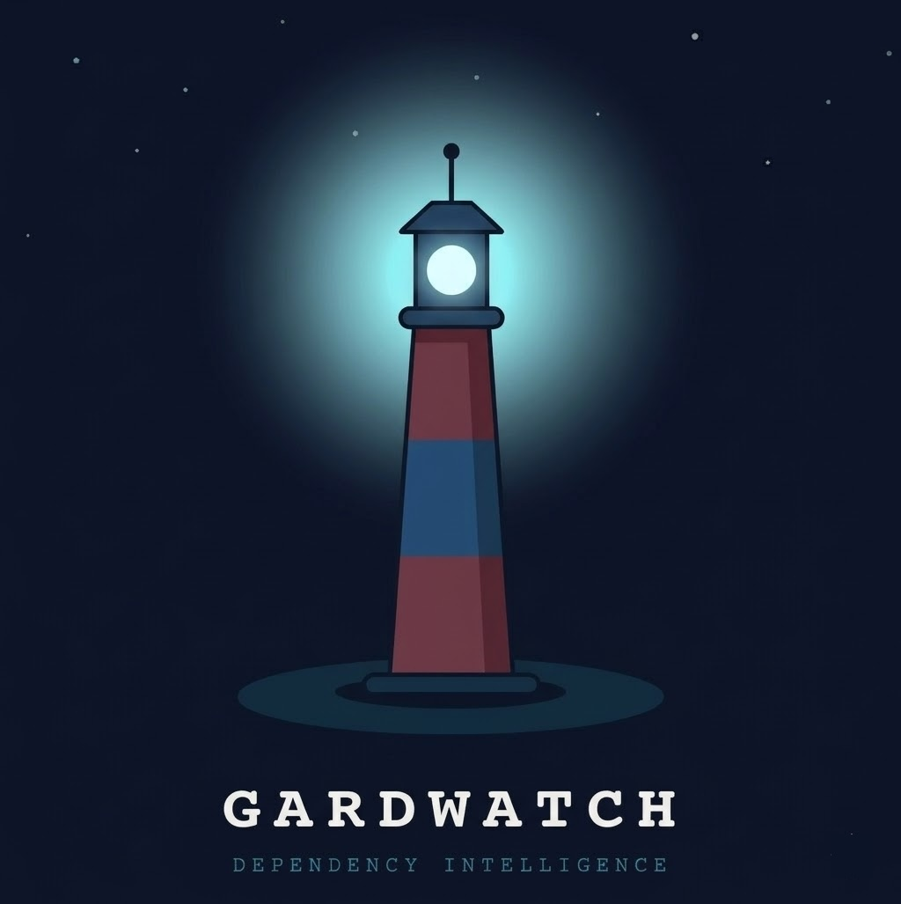

<p align="center">
  
</p>

# GardWatch 🛡️

**GardWatch** is a powerful CLI tool designed to secure your software supply chain by analyzing dependencies for trust, security risks, and quality signals. It goes beyond simple vulnerability scanning by evaluating the "health" and "trustworthiness" of a package using a composite scoring system.

## Key Features

-   **Multi-Ecosystem Support:** Analyzes packages from **PyPI** (Python), **npm** (JavaScript), **Go**, **Cargo** (Rust), **Maven** (Java), and **NuGet** (.NET).
-   **Trust Scoring Engine:** Assigns a score (0-100) based on multiple factors:
    -   **Malware Detection:** Checks against known malicious package databases.
    -   **Age & Maturity:** Rewards established packages, flags suspicious "brand new" uploads.
    -   **downloads Popularity:** Context-aware scoring based on download counts (identifies critical infrastructure vs. obscure packages).
    -   **Security Best Practices:** Integrates [OpenSSF Scorecard](https://github.com/ossf/scorecard) data.
    -   **Metadata Quality:** Checks for valid repository links, descriptions, and consistent versioning.
    -   **Threat Detection:** Identifies typosquatting, namespace squatting, and homoglyph attacks.
-   **Deep Code Scan:** Optional feature to download and scan the source code of a package for suspicious patterns (e.g., obfuscated code, network calls).
-   **Broad Input Support:** Parses `requirements.txt`, `package.json`, `Pipfile`, `go.mod`, `Cargo.toml`, `pom.xml`, `*.csproj`, and **CycloneDX SBOMs**.

## Installation

GardWatch requires Python 3.12+.

### Option 1: Install via pip (Recommended)

```bash
# Install from source
pip install git+https://github.com/GarderaSecurity/gardwatch.git

# Or clone and install locally
git clone https://github.com/GarderaSecurity/gardwatch.git
cd gardwatch
pip install .

# For development installation (editable)
pip install -e .
```

### Option 2: Using Pipenv (Development)

```bash
# Clone the repository
git clone https://github.com/GarderaSecurity/gardwatch.git
cd gardwatch

# Install dependencies
pipenv install
```

## Usage

### 1. Analyze Dependency Files
Scan your project's dependency files to get a full health report.

```bash
# Analyze a Python requirements file
gardwatch analyze requirements.txt

# Analyze a Node.js package.json
gardwatch analyze package.json

# Analyze multiple files
gardwatch analyze requirements.txt package.json Cargo.toml
```

**Options:**
-   `--deep`: Enable deep source code scanning (downloads packages to temp dir).
-   `--sbom`: Force treating the input file as a CycloneDX SBOM.
-   `--verbose`: Enable debug logging (useful for troubleshooting network issues).

### 2. Quick Package Scan
Check a single package before you install it.

```bash
# Check a PyPI package
gardwatch scan requests --pypi

# Check an npm package
gardwatch scan react --npm

# Check a Rust crate
gardwatch scan serde --cargo
```

**Supported Flags:** `--pypi`, `--npm`, `--go`, `--cargo`, `--maven`, `--nuget`.

## How It Works

GardWatch aggregates data from multiple sources, including **deps.dev**, **pypistats.org**, **npmjs.org**, and ecosystem-specific registries. It applies a set of heuristic checks to generate a report:

| Check | Impact | Description |
| :--- | :--- | :--- |
| **Malware** | ⛔ **CRITICAL** | Immediate failure if package matches known malware. |
| **Typosquatting** | ⛔ **CRITICAL** | Flags names deceptively similar to popular packages. |
| **Age** | +20 pts | Mature packages (>1 year) gain trust. Very young packages may be penalized. |
| **Downloads** | +30 pts | High download counts indicate community vetting and popularity. |
| **Security Score** | +20 pts | High OpenSSF Scorecard rating (e.g., Code Review, Branch Protection). |
| **Repository** | +10 pts | Links to a valid source code repository. |

## 🛡️ License

MIT
